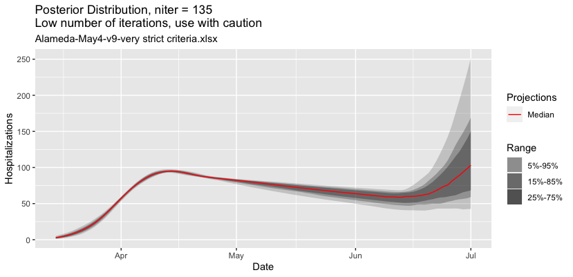
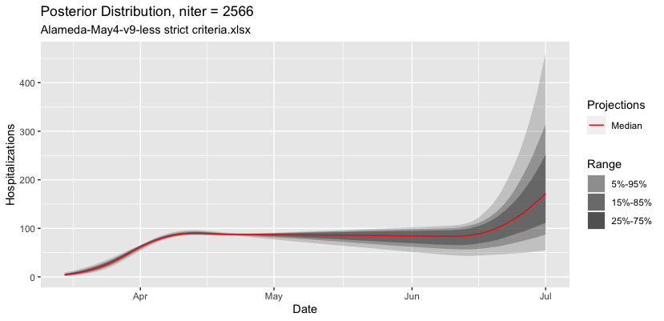

```{r, include = FALSE}
knitr::opts_chunk$set(
  collapse = TRUE,
  comment = "#>",
  fig.width=8, 
  fig.height=6
)

eval.all <- F
```
```{r setup}
library(LEMMA)
library(data.table)
library(ggplot2)
```

# San Francisco

1. Get raw data. 
It would be better to automate this, but to keep things simple, we exported as csv from https://data.sfgov.org/COVID-19/COVID-19-Hospitalizations/nxjg-bhem. This is COVID-19_Hospitalizations_SFMay4.csv.

2. Estimate Hospitilization Data bounds
`LEMMA` needs lower and upper bounds on the *true* number of people hospitalized with COVID-19 on each day. In other words, if all hospital patients in San Francisco were given a perfect COVID-19 test on Day $X$, how many would test positive for COVID-19? San Francisco has number of confirmed COVID+ and PUI (persons under investigation - suspected COVID-19). We currently assume a lower bound of 100% of confirmed and an upper bound of 100% of confirmed + 30% of PUI (adding together DPHCategory = Med/Surg and DPHCategory = ICU). 

A quick overview of the data:
```{r}
dt <- fread("COVID-19_Hospitalizations_SFMay4.csv")
dt[, date := as.Date(reportDate)]
dt[, .(meanAcrossDays = mean(PatientCount)), by = c("Hospital", "DPHCategory", "CovidStatus")]
```

Calculate bounds:
``` {r}
dt[CovidStatus == "COVID+", mult.low := 1]
dt[CovidStatus == "COVID+", mult.high := 1]
dt[CovidStatus == "PUI", mult.low := 0]
dt[CovidStatus == "PUI", mult.high := 0.3]

hosp.bounds <- dt[, .(LowerBound = sum(PatientCount * mult.low), 
                      UpperBound = sum(PatientCount * mult.high)), by=date]
hosp.bounds
```

There may be some data quality problems in March 30 - April 4:
``` {r}
ggplot(hosp.bounds, aes(x = date)) + 
  geom_line(aes(y = LowerBound)) + 
  geom_line(aes(y = UpperBound)) + 
  ylab("Hospitalizations")
```

At this point we would suggest investigating this data further with your DPH. For this vignette, we will omit the days March 30, March 31, April 3, April 4.
```{r}
hosp.bounds <- 
  hosp.bounds[!date %in% as.Date(c("2020-03-30", "2020-03-31", "2020-04-03", "2020-04-04"))]
```

Open the template Excel file (the original is `system.file("extdata", "SF-April13.xlsx", package = "LEMMA")` but the installation instructions on GitHub suggest copying it to example.xlsx in your local directory). In Excel, Save As as "SF-May4-v1.xlsx".

Copy and paste the bounds to the Hospitilization Data tab.
```{r}
write.table(hosp.bounds, sep = ",", row.names = F, col.names = F)
```

3. Choose your prior distributions in the Parameters with Distributions tab. 
These should reflect your prior knowledge, based on available research and local information. The values in the template file reflect our knowledge as of April 13 about San Francisco. We later learned that Percent of Hospitalized COVID-19 Patients That are Currently in the ICU should be lower - we changed it to 
32%	34%	36%	39%	41%

Save the Excel file.

4. Run CredibilityIntervalFromExcel (takes 1-2 minutes)
```{r, eval = eval.all}
LEMMA::CredibilityIntervalFromExcel("SF-May4-v1.xlsx")
```
Note that the "Best Guess" scenario is not compatible with the given bounds. See FAQ.md for more details on what this means. 

5. Examine the .pdf and/or .xlsx output. 
The first page of the .pdf says we have 342 iterations in the posterior distribution. This is also shown at the top of the Notes column on each .xlsx sheet.

6. Adjust and rerun. 
We suggest at least 1000 iterations in the posterior distribution for inference about the 5th-95th quantiles. On the Internal sheet to, change `main.iterations` to 35000. 
The current output only projects until May 1. On the Model Inputs sheet, change Projection End Date to 9/1/2020.
Save As SF-May4-v2.xlsx and rerun CredibilityIntervalFromExcel (takes ~5 minutes). This gives 1101 posterior iterations.
```{r, eval = eval.all}
LEMMA::CredibilityIntervalFromExcel("SF-May4-v2.xlsx")
```

# Alameda County
1. Get the raw data: https://data.acgov.org/datasets/AC-HCSA::alameda-county-covid-19-hospitalizations
As above, it would be better to automate this, but for now we exported as 
Alameda_County_COVID-19_HospitalizationsMay4.csv

```{r}
dt <- fread("Alameda_County_COVID-19_HospitalizationsMay4.csv")
head(dt)
```

2. Estimate Hospitilization Data bounds
Alameda County does not appear to have public PUI data. We will use the number of confirmed cases at the LowerBound.
```{r}
hosp.bounds <- dt[, .(date = as.Date(Date, format = "%m/%d/%y"), LowerBound = Hospitalized_COVID_19_Positive_)]
```
The data looks somewhat noisy. 
```{r}
ggplot(hosp.bounds, aes(x=date, y=LowerBound)) + geom_point()
```
Let's see what happens if we use it as-is.

In San Francisco, the UpperBound is roughly 115% of the LowerBound, so we could use than as a first approximation.
```{r}
hosp.bounds[, UpperBound := LowerBound * 1.15]
ggplot(hosp.bounds, aes(x = date)) + geom_line(aes(y = LowerBound)) + geom_line(aes(y = UpperBound)) + ylab("Hospitalizations")
```

Open the template Excel file. In Excel, Save As as "Alameda-May4-v1.xlsx".

On the Model Inputs sheet, change Number of People in Area to 1671000

Copy and paste the bounds to the Hospitilization Data tab.
```{r}
write.table(hosp.bounds, sep = ",", row.names = F, col.names = F)
```

3. Choose your prior distributions in the Parameters with Distributions tab. 
As an example, let's use the numbers in the template.

4. Run CredibilityIntervalFromExcel
```{r, eval = eval.all}
LEMMA::CredibilityIntervalFromExcel("Alameda-May4-v1.xlsx")
```

5. Examine the .pdf and/or .xlsx output. 
The first page of the .pdf says we have 0 iterations. Obviously we need to make some changes.

The April 16 data is clearly an outlier. Delete that row in Excel. (Because the sheet is protected, it's probably easiest to cut and paste everything else.)

Save As Alameda-May4-v2.xlsx.

```{r, eval = eval.all}
LEMMA::CredibilityIntervalFromExcel("Alameda-May4-v2.xlsx")
```

Running CredibilityIntervalFromExcel still gives 0 iterations.

6. Try smoothing the data.
```{r}
hosp.bounds <- hosp.bounds[date != as.Date("2020-04-16")]
hosp.bounds[, orig.lower := LowerBound]
hosp.bounds[, orig.upper := UpperBound]
hosp.bounds[, date.index := 1:.N]
m1 <- loess(LowerBound ~ date.index, data = hosp.bounds, span = 0.4)
hosp.bounds$LowerBound <- predict(m1)
hosp.bounds[, UpperBound := LowerBound * 1.15]

ggplot(hosp.bounds, aes(x = date)) +
  geom_line(aes(y = LowerBound)) +
  geom_line(aes(y = UpperBound)) +
  geom_point(aes(y=orig.upper, shape = "Upper Bound"), fill = "black", na.rm = T) +
  geom_point(aes(y=orig.lower, shape = "Lower Bound"), fill = "black", na.rm = T) 
```
Copy and paste the bounds to the Hospitilization Data tab.
```{r}
write.table(hosp.bounds[, .(date, LowerBound, UpperBound)], 
            sep = ",", row.names = F, col.names = F)
```
To get fast feedback on just the Best Guess scenario, set main.iterations to 1.

Save As Alameda-May4-v3.xlsx.

```{r, eval = eval.all}
LEMMA::CredibilityIntervalFromExcel("Alameda-May4-v3.xlsx")
```

7. Adjust Prior Distribution for Best Guess
It looks like our "best guess" of R0 = 3.5 is too low to match the data. Try R0 = 4.
Save As Alameda-May4-v4.xlsx.

It may be more convenient to plot within RStudio so we don't have to refer to the .pdf output. 
```{r}
z <- LEMMA::CredibilityIntervalFromExcel("Alameda-May4-v4.xlsx")
print(z$gplot)
```

Try fitting E0 (the initial number of exposed) using only the days before peak hospitalization.
On the Interal sheet, set max.obs.date.to.fit to 4/10/2020.
```{r}
z <- LEMMA::CredibilityIntervalFromExcel("Alameda-May4-v5.xlsx")
print(z$gplot)
```

Now the beginning looks better, but then the multiplier for one of the interventions needs to be stronger. Change the first Re multiplier from 0.6 to 0.5.
```{r}
z <- LEMMA::CredibilityIntervalFromExcel("Alameda-May4-v6.xlsx")
print(z$gplot)
```

We might be getting in the ballpark. Let's try a flatter prior distribution. Set all Priors to 20%. Set Re multiplier to 0.35	0.4	0.45 0.55	0.7. Set main.iterations to 10000. Set required.in.bounds to 95%. 

```{r, eval = eval.all}
LEMMA::CredibilityIntervalFromExcel("Alameda-May4-v7.xlsx")
```

Now we at least have 34 iterations. Based on the histograms in the .pdf output, we might need a longer hospital length of stay (if you have data on this, that would be even better!).
```{r, eval = eval.all}
LEMMA::CredibilityIntervalFromExcel("Alameda-May4-v8.xlsx")
```

Now we have 117 iterations.

We continued this process and eventually were able to come up with priors that fit the data well. We then increased main.iterations to 200000 to get a large number of posterior iterations.

This was not shown above, but another thing to try is increasing upper.bound.multiplier and/or decreasing lower.bound.multiplier. This will include combinations of parameters that give projections slightly (more) outside the given LowerBound and UpperBound. 

## Important Considerations

In this case study, an important question is: how confident are we in the UpperBound of the most recent days? These are important because hospitalization appears to be declining. If we force the model to be lower than exactly UpperBound (upper.bound.multiplier = 1) on every day (required.in.bounds = 100%), projections will be more optimistic. 

There are several reasons why it may be more prudent to use less strict bounds (perhaps lower.bound.multiplier = 0.95; upper.bound.multiplier = 1.10) and to allow the projections to be outside the bounds for some days (perhaps required.in.bounds = 90%) . For Alameda County, PUI data was not available so it is especially difficult to know the true number of COVID-19 positive. Even if PUI data were available, it is also possible that the recent decline is due to random fluctuation or reasons not captured by our model. 

```{r, eval = F}
#This will take at least 30 minutes
LEMMA::CredibilityIntervalFromExcel("Alameda-May4-v9-very strict criteria.xlsx")
```

```{r, eval = F}
#This will take at least 30 minutes
LEMMA::CredibilityIntervalFromExcel("Alameda-May4-v9-less strict criteria.xlsx")
```

# Modelling Lifting Shelter In Place

Lifting Shelter in Place can be modelled as a future intervention which multiplies Re by a factor greater than 1. This is already set in the existing xlsx inputs. We just need to change Model Inputs -> Projection End Date to a later date to see the effect.






